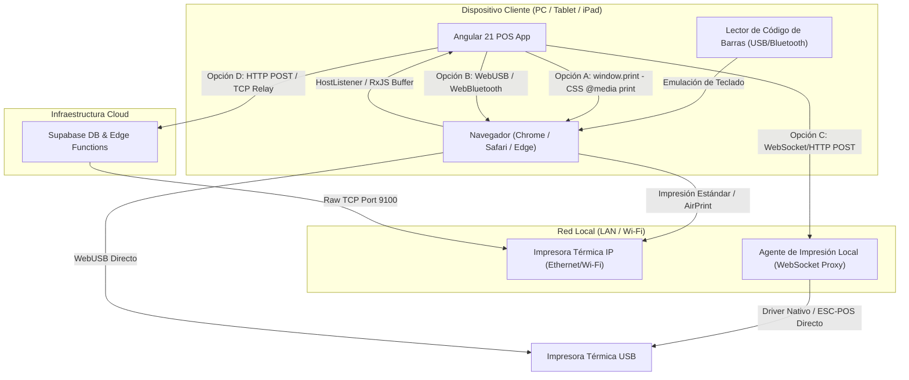

# Plan de Integración de Periféricos para Punto de Venta (POS)
## Proyecto: Hula-Hoop (Angular 21 + Supabase)

Este documento detalla el análisis estratégico, técnico y de arquitectura para transformar la aplicación web **Hula-Hoop** en un Punto de Venta (POS) completamente funcional y capaz de comunicarse con hardware especializado: **lectores de código de barras** e **impresoras térmicas de tickets**, operando de forma fluida en **Windows PC, tabletas iOS (iPad) y tabletas Android**.

---

## 1. Arquitectura General de Integración

En una aplicación web estándar (ejecutándose en navegadores), el acceso directo al hardware local está restringido por el sandbox de seguridad del navegador. A continuación se presenta el diagrama de arquitectura con las diferentes rutas de comunicación de periféricos:



---

## 2. Lectores de Código de Barras: Estrategia y Código

### Funcionamiento Técnico
El 99% de los lectores de códigos de barras (sean USB o Bluetooth) funcionan por defecto en **Modo de Emulación de Teclado (HID)**. Para el sistema operativo y el navegador, el lector es simplemente un usuario que escribe extremadamente rápido (1 caracter cada 1-5 milisegundos) y finaliza con la tecla `Enter` o `Tab`.

### Implicaciones e Implementación en Angular 21
Para evitar tener que mantener el foco obligatoriamente en un input de texto, implementamos un **servicio o directiva global** en Angular que capture estas pulsaciones ultrarrápidas, las procese en un buffer temporal utilizando **RxJS**, y emita el código completo cuando detecte el fin de la lectura.

#### Código de Producción: `barcode-scanner.service.ts`

```typescript
import { Injectable, OnDestroy } from '@angular/core';
import { Subject, Subscription } from 'rxjs';
import { buffer, debounceTime, filter, map } from 'rxjs/operators';

@Injectable({
  providedIn: 'root'
})
export class BarcodeScannerService implements OnDestroy {
  private keyStroke$ = new Subject<KeyboardEvent>();
  private barcodeScannedSource = new Subject<string>();
  
  // Observable público para suscribirse desde cualquier componente (ej. Carrito)
  public barcodeScanned$ = this.barcodeScannedSource.asObservable();
  private subscription: Subscription;

  constructor() {
    this.subscription = this.keyStroke$.pipe(
      // Agrupamos las teclas pulsadas. Si pasan más de 30ms sin una tecla,
      // asumimos que terminó de transmitir el escáner (un humano no escribe tan rápido).
      buffer(this.keyStroke$.pipe(debounceTime(30))),
      // Convertimos el array de eventos de teclado a un string legible
      map((events: KeyboardEvent[]) => {
        return events
          .filter(e => e.key !== 'Enter' && e.key !== 'Shift') // Omitimos teclas de control
          .map(e => e.key)
          .join('');
      }),
      // Evitamos strings vacíos o demasiado cortos que no sean códigos de barras válidos
      filter((code: string) => code.length >= 4)
    ).subscribe(barcode => {
      this.barcodeScannedSource.next(barcode);
    });
  }

  // Este método debe ser llamado desde un HostListener en el AppComponent o layout principal
  public handleGlobalKeyEvent(event: KeyboardEvent): void {
    // Si el usuario está escribiendo activamente en un input de comentarios, no interferir
    const target = event.target as HTMLElement;
    if (target && (target.tagName === 'INPUT' || target.tagName === 'TEXTAREA')) {
      // Opcional: Permitir escaneo si el input específico tiene una clase 'barcode-input'
      if (!target.classList.contains('allow-barcode')) {
        return;
      }
    }
    this.keyStroke$.next(event);
  }

  ngOnDestroy(): void {
    if (this.subscription) {
      this.subscription.unsubscribe();
    }
  }
}
```

> [!TIP]
> **Lectura por Cámara (Tabletas):** Si la tableta no tiene escáner físico, puedes integrar la cámara usando `html5-qrcode` o `@zxing/ngx-scanner`. Esto activa la cámara trasera del iPad o tableta Android para decodificar códigos QR y de barras en tiempo real.

---

## 3. Impresoras Térmicas de Tickets (ESC/POS)

La impresión térmica requiere enviar comandos binarios formateados bajo el estándar **ESC/POS** (creado originalmente por Epson). Hay 4 vías principales para lograr esto desde una web app:

### Matriz Comparativa de Métodos de Impresión

| Método | Silencioso (Sin Diálogo) | Compatibilidad OS | Dificultad Técnico | Requerimientos de Hardware / Software |
| :--- | :--- | :--- | :--- | :--- |
| **A. `window.print()` (Media CSS)** | ❌ No (Requiere confirmación) | Windows, iOS, Android, macOS | ⭐ Fácil | Ninguno. Usa el driver del sistema. |
| **B. WebUSB / WebBluetooth** | ✔️ Sí | Windows, Android (Chrome) | ⭐⭐⭐⭐ Alta | Navegador compatible (Safari iOS **no** lo soporta). |
| **C. Agente Proxy Local (QZ Tray / Node)** | ✔️ Sí | Windows, macOS, Linux | ⭐⭐⭐ Media | Un software ligero corriendo en segundo plano en la PC. |
| **D. Impresión IP Directa (Network)** | ✔️ Sí | Todos (Windows, iOS, Android) | ⭐⭐⭐ Media | Impresora con puerto Ethernet/Wi-Fi y red local compartida. |

---

## 4. Análisis de Viabilidad por Dispositivo y Sistema Operativo

### 💻 Windows PC
Es la plataforma con **mayor flexibilidad**. Soporta todas las opciones:
- **Estrategia Recomendada:** Un **Agente Proxy Local** (un pequeño script de Node.js o Python compilado en segundo plano) o **WebUSB**.
- **Ventajas:** Permite impresión directa e instantánea y apertura del cajón de dinero conectado a la impresora a través del puerto RJ11 (mediante pulsos de corriente de 24V).
- **Lectores:** Conexión directa por USB sin configuración adicional.

### 📱 iOS / iPadOS (Tabletas)
Apple tiene un sandbox sumamente estricto y **Safari no soporta WebUSB ni WebBluetooth**.
- **Estrategia Recomendada:** **Impresoras de Red (Ethernet/Wi-Fi)**. El iPad envía la orden al backend (Supabase Edge Function o API de servidor local relay), y este envía los comandos ESC/POS a la dirección IP de la impresora en el puerto 9100.
- **Alternativa Visual:** Usar **AirPrint** con una impresora térmica compatible con Apple AirPrint, imprimiendo mediante `window.print()`. Sin embargo, esto muestra la ventana emergente de confirmación de iOS.
- **Lectores:** Lectores de códigos de barras Bluetooth configurados en modo teclado (HID).

### 🤖 Android Tablets
Tienen mayor apertura que iOS. Chrome para Android **sí** tiene soporte parcial de WebUSB.
- **Estrategia Recomendada:** **Impresoras de Red (IP)** por su alta estabilidad, o **Impresoras Bluetooth** usando una envoltura híbrida.
- **Lectores:** Conexión mediante adaptador OTG (USB) o Bluetooth (HID).

---

## 5. El Camino a Seguir (Roadmap de Implementación)

Para lograr un Punto de Venta 100% funcional y listo para producción, se propone el siguiente plan por fases:

### Fase 1: Arquitectura de Datos y Estado Local (El Core)
1. **Modelado en Supabase:**
   - Crear tablas para `ventas`, `detalles_venta`, `cajas` (sesiones de apertura/cierre) y `metodos_pago`.
   - Implementar control de stock transaccional robusto (triggers para decrementar stock al vender).
2. **Estado en Angular (RxJS / Signals):**
   - Implementar un `CartService` reactivo que mantenga los productos, calcule impuestos, descuentos y totales al instante.

### Fase 2: Integración de Escáner y Búsqueda Rápida
1. Implementar el `BarcodeScannerService` global en Angular.
2. Añadir retroalimentación sonora con un pitido electrónico (utilizando la API del navegador `AudioContext`) cuando un escaneo sea exitoso o falle.
3. Crear un fallback visual de búsqueda rápida por teclado o selector de imágenes táctil en la UI para tabletas.

### Fase 3: Integración de Impresión de Tickets
1. **Diseñar el layout del ticket en HTML/CSS:**
   - Usar un ancho fijo de `80mm` o `58mm` con fuentes sans-serif condensadas y sin márgenes innecesarios.
2. **Implementar el Canal de Impresión de Red (La opción más escalable para iPad y PC):**
   - Configurar una función en Supabase (o un microservicio local ligero en la tienda) que acepte el JSON de la venta, lo traduzca a bytes de comandos ESC/POS y lo envíe directamente a la IP de la impresora.
   
#### Ejemplo de Estructura de Comandos ESC/POS (TypeScript):
```typescript
export function buildReceiptESCPOS(venta: any): Uint8Array {
  const encoder = new TextEncoder();
  const init = new Uint8Array([0x1B, 0x40]); // ESC @ (Inicializar)
  const alignCenter = new Uint8Array([0x1B, 0x61, 0x01]); // ESC a 1 (Alinear Centro)
  const alignLeft = new Uint8Array([0x1B, 0x61, 0x00]); // ESC a 0 (Alinear Izquierda)
  const boldOn = new Uint8Array([0x1B, 0x45, 0x01]); // ESC E 1 (Negrita ON)
  const boldOff = new Uint8Array([0x1B, 0x45, 0x00]); // ESC E 0 (Negrita OFF)
  const cutPaper = new Uint8Array([0x1D, 0x56, 0x42, 0x00]); // GS V B 0 (Corte parcial)
  const openDrawer = new Uint8Array([0x1B, 0x70, 0x00, 0x19, 0xFA]); // ESC p 0 t1 t2 (Apertura de cajón)

  let bytes = new Uint8Array();
  
  // Helper para concatenar buffers de bytes
  const append = (newBytes: Uint8Array) => {
    const combined = new Uint8Array(bytes.length + newBytes.length);
    combined.set(bytes);
    combined.set(newBytes, bytes.length);
    bytes = combined;
  };

  append(init);
  append(alignCenter);
  append(boldOn);
  append(encoder.encode("HULA-HOOP SHOP\n"));
  append(boldOff);
  append(encoder.encode("Rua Exemplo, 123 - Ciudad\n"));
  append(encoder.encode("--------------------------------\n"));
  append(alignLeft);
  
  // Agregar productos
  venta.productos.forEach((p: any) => {
    append(encoder.encode(`${p.cantidad}x ${p.nombre.substring(0, 18).padEnd(18)} $${p.total.toFixed(2)}\n`));
  });
  
  append(encoder.encode("--------------------------------\n"));
  append(boldOn);
  append(encoder.encode(`TOTAL: $${venta.total.toFixed(2)}\n\n`));
  append(boldOff);
  
  append(openDrawer); // Abre el cajón monedero automáticamente antes de cortar
  append(cutPaper);   // Corta el ticket
  
  return bytes;
}
```

### Fase 4: Modo Offline (Estrategia Crítica para POS)
Un punto de venta no puede dejar de operar si se cae la conexión a internet.
1. **IndexedDB / LocalStorage:** Almacenar de manera local el catálogo de productos y precios al iniciar el día.
2. **Cola de Ventas Pendientes:** Si Supabase está offline, guardar las ventas localmente.
3. **Sincronización:** Una vez que la conexión retorne, un servicio en segundo plano sincronizará de forma secuencial las ventas con la base de datos de Supabase.

---

## 6. Implicaciones y Retos Técnicos

1. **Protocolo Seguro (HTTPS / SSL):**
   Las APIs del navegador como WebUSB, WebBluetooth y el acceso a la cámara para lectura de códigos de barras **requieren de forma obligatoria que el sitio corra bajo HTTPS** (excepto en `localhost` durante el desarrollo).
2. **Control de Red Local e IPs Estáticas:**
   Si se opta por impresoras IP, cada impresora térmica debe configurarse en la tienda con una **IP estática** fuera del rango DHCP del router para evitar que cambie su dirección al reiniciarse.
3. **CORS (Cross-Origin Resource Sharing):**
   Si la aplicación Angular intenta enviar datos de red TCP directamente desde el navegador a la impresora, el navegador podría bloquearlo por seguridad. Por ello, la vía óptima es que el backend o un proxy local procese el socket de impresión.
4. **Diseño UX/UI Premium Adaptado a POS:**
   Los cajeros necesitan interfaces táctiles de alta velocidad. El tamaño de los botones debe ser amplio (mínimo 48px de área táctil), con retroalimentación sonora inmediata, transiciones fluidas de adición al carrito e indicadores claros del estado de la conexión a internet.
