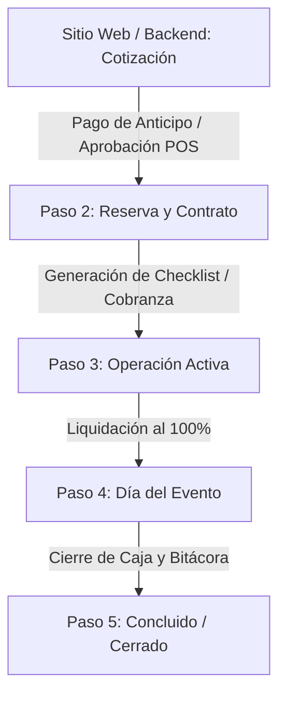

# Plan de Arquitectura: Integración Unificada de Reservas, Cotizaciones, Contratos y Eventos

Este plan detalla el diseño arquitectónico propuesto para fusionar el sistema original de reservas en línea (landing page) con el nuevo ecosistema integrado de **Clientes (CRM), Cotizaciones, Contratos, Gestión Operativa de Eventos y Caja/POS**.

---

## 1. Análisis del Contexto y Diagnóstico

### Estado Actual
El sistema tiene dos lógicas paralelas creadas en distintas etapas del desarrollo:
1.  **Lógica Original (Reservas Públicas):** Inserta directamente en `private_reservations` y `playdate_reservations`. Se enfoca en la disponibilidad horaria (`time_slots`), pasarela de pagos (Mercado Pago) y folios con tokens de acceso públicos.
2.  **Lógica Nueva (Gestor Administrativo):** Cuenta con tablas para `clients`, `quotes` (cotizaciones), `contracts` (contratos), `contract_payments` (pagos), `event_tasks` (checklist de staff) y `pos_sales` (ventas POS).

Actualmente, las reservas realizadas por clientes públicos en el sitio web no alimentan de forma automática la base de datos de Cotizaciones o Contratos, lo que crea silos de información y obliga a los managers a duplicar registros manualmente.

---

## 2. Definición del Mejor Camino: "Bridge & Unify" (Puente y Unificación)

### Decisión de Arquitectura: Opción A
Como Arquitecto de Software, **recomiendo firmemente mantener la separación de tablas físicas (`private_reservations` por un lado y `quotes`/`contracts` por el otro), pero unificar su lógica y ciclo de vida en el backend mediante un flujo automatizado y transparente.**

#### ¿Por qué es la mejor opción en lugar de fusionar todo en una sola tabla?
1.  **Mitigación de Riesgos y Estabilidad:** Reescribir el flujo de reserva pública (que incluye validaciones complejas de slots en Angular, hooks de Mercado Pago y generación de enlaces de pago) para que inserte directamente en cotizaciones/contratos/clientes es altamente propenso a errores y rompería la pasarela de pago actual.
2.  **Campos de Dominio Específicos:** La tabla `private_reservations` contiene campos extremadamente acoplados al motor de reservas (como `time_slot_id`, `guest_count` y `snack_option_id`) que no pertenecen de forma natural a una tabla de facturación comercial (`contracts` o `quotes`).
3.  **Relaciones Existentes:** La base de datos ya cuenta con las columnas `quote_id` y `contract_id` en `private_reservations`. Aprovechando estas llaves foráneas, podemos entrelazar todo el ciclo de vida sin alterar las bases del motor de checkout.

---

## 3. Ciclo de Vida del Evento (Los 5 Pasos del Flow Operativo)

El núcleo operativo en el backend administrativo será el **Contrato** (el cual representa 1-a-1 al **Evento**). Proponemos el siguiente flujo de estados y pasos para el manager:



### Paso 1: Cotización (Quote)
*   **Origen:** Puede generarse en línea por el cliente (al completar el asistente de reservas sin pagar) o directamente por un manager en el backend.
*   **Entidades:** Se crea un registro en `clients` (CRM), un registro en `quotes` (estado: `borrador` o `pendiente`) y un registro en `private_reservations` (estado: `pending_payment`).
*   **Efecto:** La fecha y el horario **no se bloquean** aún (quedan disponibles para otros cotizantes).

### Paso 2: Reserva y Contrato (Reserved & Blocked)
*   **Gatillo:** Se detecta el pago del anticipo (vía webhook de Mercado Pago o cobro manual en POS/Caja registrado por el cajero).
*   **Lógica Automática:**
    1.  `private_reservations.status` cambia a `confirmed`. Esto **bloquea el horario de forma inmediata** en el calendario de la sucursal.
    2.  `quotes.estado` cambia a `aprobada`.
    3.  Se crea automáticamente un registro en `contracts` en estado `reservado`, enlazando el `client_id`, `quote_id` y copiando los montos totales, fecha de evento y horario.
    4.  Se registra el pago del anticipo en `contract_payments`.
*   **Efecto:** El slot queda 100% fuera de disponibilidad. Nadie más puede reservar esa fecha ni hacer Play Day en ese horario.

### Paso 3: Operación Activa (Operational Checklist)
*   **UX del Manager:** El manager entra a un nuevo **"Event Hub"** en el administrador que despliega el evento en un asistente visual de pestañas/steps:
    *   **Tab 1: Resumen & Firma:** Genera el PDF del contrato y permite marcar el estado de firma física o digital del cliente.
    *   **Tab 2: Checklist (Actividades):** Muestra las tareas en la tabla `event_tasks` (por ejemplo: comprar pastel, inflar globos, asignar animadores) asignando responsables del staff.
    *   **Tab 3: Cobranza (Finanzas):** Permite registrar abonos adicionales en `contract_payments` y muestra el `saldo_pendiente` en tiempo real.
    *   **Tab 4: Gastos del Evento:** Registra compras o egresos específicos en `admin_expenses` imputados directamente al `contract_id` para calcular el P&L del evento.

### Paso 4: Día del Evento (Execution)
*   **Regla de Negocio:** El sistema exige y valida que el contrato esté **100% liquidado** (`saldo_pendiente = 0`) para pasar a este estado.
*   **Staff:** El checklist del día del evento se activa para el staff operativo en su portal móvil de actividades.

### Paso 5: Concluido (Closed & Reporting)
*   **Cierre:** Una vez finalizado el evento, el manager lo marca como `concluido`.
*   **Auditoría:** Se abre un formulario rápido para reportar:
    *   Novedades o incidencias (ej. daños al salón).
    *   Cargos extra post-evento (cobrados a través del POS si es necesario).
*   **Efecto:** El contrato se bloquea para evitar modificaciones financieras posteriores.

---

## 4. Play Day: Flujo Operativo y de Capacidad

A diferencia de los eventos privados, el Play Day es una venta masiva con capacidad limitada.

### Estructura de Capacidad
*   Cada `time_slot` tiene una capacidad máxima (definida en `venue_config.max_capacity_per_slot`).
*   La disponibilidad de Play Day se calcula restando la suma de los boletos vendidos en `playdate_reservations` para esa fecha y hora, y se reduce a cero (0) si existe un evento privado confirmado en ese mismo horario.

---

## 5. Decisiones de UX/UI y Diseño Técnico de POS

Tras analizar las mejores prácticas de la industria en sistemas de punto de venta (como Clover, Square u Odoo POS), definimos las siguientes soluciones para garantizar una operatividad ágil y una analítica financiera impecable.

### 5.1 Venta de Boletos en POS: "Smart Products" (UX de Carrito Único)
*   **Problema de UX común:** Separar la venta de boletos en una pantalla y los alimentos de cafetería en otra hace lenta la taquilla, duplica las transacciones y frustra al cliente.
*   **Solución UX Premium:** **Carrito de Compra Único.** El boleto de Play Day es simplemente un producto más en el catálogo del POS (categoría "Accesos").
*   **Flujo del Cajero (Sencillo y Rápido):**
    1.  El cliente llega y dice: *"Quiero 2 entradas de Play Day y un Capuchino grande"*.
    2.  El cajero hace clic en **"Boleto Play Day"** (se añade 2 veces al carrito) y en **"Capuchino"** (se añade al carrito).
    3.  **Validación de Capacidad Invisible:** Al añadir el boleto, el POS realiza una consulta ultraligera en segundo plano al backend. Si hay cupo, se agrega sin fricciones. Si el cupo está lleno, la interfaz muestra un toast preventivo: *"¡Cupo de Play Day Completo para este Turno!"*.
    4.  El cajero da clic en **"Cobrar"** y procesa un único pago.
    5.  **Acción Atómica en Backend:** Al confirmar la venta, el sistema automáticamente:
        *   Registra la venta en `pos_sales` con sus partidas correspondientes.
        *   Crea la reserva confirmada en `playdate_reservations` para descontar el cupo en tiempo real.
        *   Imprime el ticket del café y los brazaletes físicos de acceso.

---

### 5.2 Corte y Reporte Multiturno: "Transaction-Level Scoping" (A nivel de Transacción)
*   **El Reto de Negocio:** Permitir a los managers la flexibilidad de cerrar caja una sola vez al día (Corte Diario) o por cada evento/turno, manteniendo la imputación exacta de cada café y snack al centro de costo correspondiente.
*   **La Solución Arquitectónica:** En lugar de ligar la *Sesión de Caja completa* (`pos_sessions`) a un único evento o turno, **trasladamos la imputación financiera a nivel de Transacción (`pos_sales`)**.

```
                   ┌──────────────────────────────────────┐
                   │   Sesión de POS del Cajero (Todo el Día) │
                   └──────────────────┬───────────────────┘
                                      │ (Múltiples Ventas)
         ┌────────────────────────────┼────────────────────────────┐
         ▼                            ▼                            ▼
 ┌───────────────┐            ┌───────────────┐            ┌───────────────┐
 │   Venta #1    │            │   Venta #2    │            │   Venta #3    │
 │ Imputado a:   │            │ Imputado a:   │            │ Imputado a:   │
 │ Evento C-001  │            │ Play Day Sáb  │            │ Venta Libre   │
 └───────────────┘            └───────────────┘            └───────────────┘
```

#### Modificación de Esquema (Base de Datos)
El enlace financiero se almacena en cada transacción individual:

```sql
ALTER TABLE pos_sales
  ADD COLUMN IF NOT EXISTS contract_id UUID REFERENCES contracts(id) ON DELETE SET NULL,
  ADD COLUMN IF NOT EXISTS playdate_date DATE,
  ADD COLUMN IF NOT EXISTS playdate_time_slot_id UUID REFERENCES time_slots(id) ON DELETE SET NULL;

-- Índices optimizados para reportes de rentabilidad
CREATE INDEX IF NOT EXISTS idx_pos_sales_event_scope ON pos_sales(contract_id);
CREATE INDEX IF NOT EXISTS idx_pos_sales_playdate_scope ON pos_sales(playdate_date, playdate_time_slot_id);
```

#### UX de la Pantalla del Cajero (Cero Fricciones)
*   En la barra superior del POS, se muestra un selector simple: **"Registrar Consumos en:"** (con un valor por defecto de "Venta General/Libre").
*   Al comenzar a atender a un cliente de una fiesta, el cajero selecciona el evento (ej. *"Cumpleaños Sofía"* o escanea su código de barras del brazalete/tarjeta).
*   Cualquier producto cobrado en ese momento se guardará con el `contract_id` correspondiente.
*   Para clientes de Play Day, se auto-selecciona el turno en curso de Play Day.
*   **El Cajero no tiene que cerrar su caja para cambiar de evento; solo cambia el selector superior con un clic.**

---

### 5.3 Reporte Consolidado Flexible (P&L Multi-Ámbito)
Esta arquitectura permite generar reportes dinámicos de caja diarios, semanales o por turno, desglosando la utilidad con precisión quirúrgica:

```sql
-- P&L Consolidado de un Turno de Play Day
SELECT 
  -- Ingresos de Boletaje (Filtra reservas confirmadas online o por taquilla)
  COALESCE((
    SELECT SUM(total_cents) / 100.0 
    FROM playdate_reservations 
    WHERE reservation_date = '2026-05-27' 
      AND time_slot_id = 'id_del_time_slot' 
      AND status = 'confirmed'
  ), 0) AS ingresos_entradas,

  -- Ingresos de Cafetería/Consumos imputados directamente a este bloque
  COALESCE((
    SELECT SUM(total) 
    FROM pos_sales 
    WHERE playdate_date = '2026-05-27' 
      AND playdate_time_slot_id = 'id_del_time_slot'
  ), 0) AS ingresos_cafeteria;
```

---

## 6. Cronograma de Implementación Propuesto (Orden de Prioridad Optimizado)

Para evitar la generación de "datos ocultos" (registros en la base de datos invisibles para los administradores) y resolver de inmediato los bugs activos en producción, adoptamos el siguiente orden de fases:

### Fase 1: Correcciones Críticas de Producción (UI Visible & Concurrencia)
*   Refactorizar `quote-public-page.ts` para eliminar la llamada Zoneless asíncrona de `ngOnInit` y cargar la cotización de forma reactiva en el constructor.
*   Añadir el botón **"Aprobar y Pagar"** en la página de cotización pública redirigiendo de forma segura al flujo de reservas.
*   Implementar el índice único parcial `idx_private_reservations_confirmed_slot` en PostgreSQL para mitigar al 100% el riesgo de doble-booking en slots populares.

### Fase 2: Mejoras al Event Hub Existente en Admin (UX Visible)
*   El componente `admin-event-detail` **ya existe** con 5 pestañas funcionales (resumen, pagos, cotización, tareas, gastos). No se crea desde cero.
*   Mejoras a agregar: barra visual de progreso de estados del contrato (Tailwind, sin PrimeNG Stepper), validación que bloquea avanzar a "Día del Evento" si hay saldo pendiente, y bloqueo de edición financiera en estado `concluido`.

### Fase 3: Base de Datos y Triggers Transaccionales (Automatización)
*   Creación de funciones y triggers en Postgres para que, al confirmarse un pago de Mercado Pago o POS sobre un `private_reservation_id`, se sincronicen de forma atómica:
    *   El alta del cliente en `clients` (si no existía previamente por correo).
    *   La conversión de cotización en contrato con folio único (`contracts`). **Nota:** si `quote_id IS NULL` (reserva directa sin cotización previa), el trigger igualmente crea el cliente y el contrato, saltando solo la actualización de `quotes.estado`.
    *   El abono automático a `contract_payments`.
*   Aplicación de la extensión de esquema en `pos_sales` para soportar la imputación granular de eventos y turnos (transaction-level scoping).

### Fase 4: Punto de Venta Dinámico (Selector de Ámbito & Smart Products)
*   Los boletos de Play Day se modelan como `restaurant_items` con `categoria = 'acceso'`. Se inserta un registro por venue usando el precio de `venue_config.playdate_ticket_price_cents`. Esto evita crear una nueva tabla y aprovecha el catálogo POS existente.
*   Al agregar un boleto al carrito, el POS verifica disponibilidad con `getPlaydateAvailability()` (método ya existe en `ReservationService`). Si no hay cupo, muestra toast y cancela la inserción.
*   Selector de imputación en cabecera del POS: Venta Libre / Evento Privado / Play Day. El `contract_id` o `playdate_date+time_slot_id` se persiste directamente en `pos_sales` (transaction-level).
*   Al cerrar una venta con boletos de acceso, se crean registros en `playdate_reservations` con `status = 'confirmed'`.

### Fase 5: Reportes Consolidados de Rentabilidad
*   **DROP + recrear** la vista `event_profit_loss` que actualmente calcula ingresos POS via `pos_sessions.contract_id` (nivel de sesión). La nueva versión usa `pos_sales.contract_id` directamente (transaction-level scoping de Fase 3).
*   Crear nueva vista `playdate_profit_loss` para P&L por turno de Play Day: boletaje + consumos de cafetería imputados al turno.
*   La vista de reporteo en admin puede usar ambas vistas para consolidar rentabilidad diaria, semanal o por evento.
